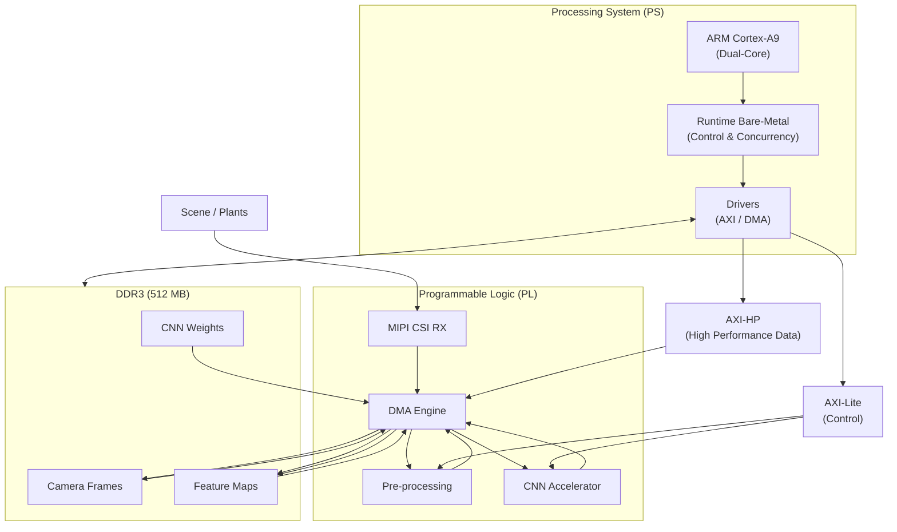
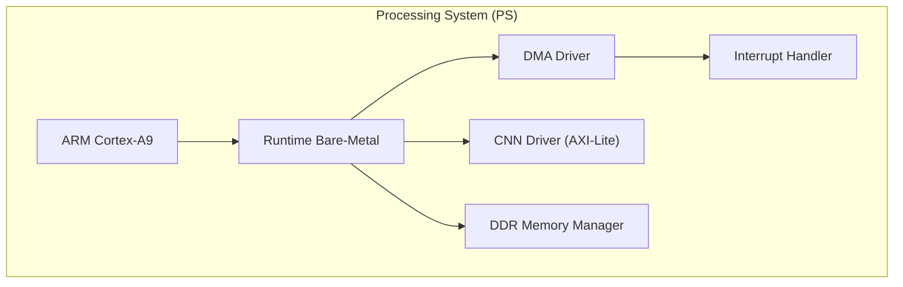
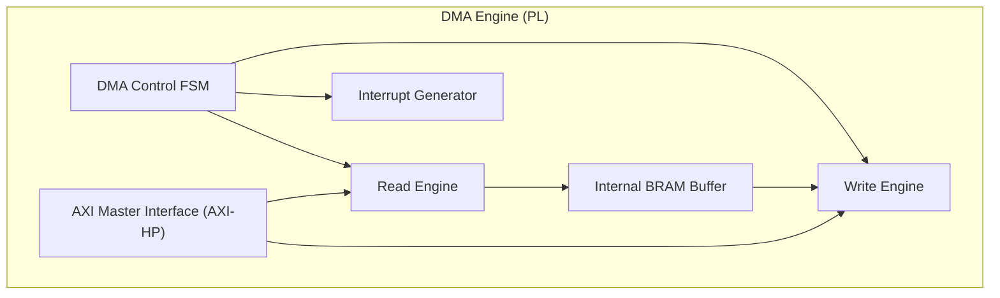
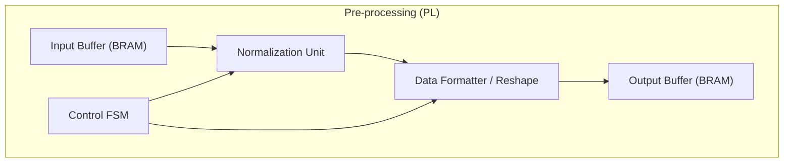
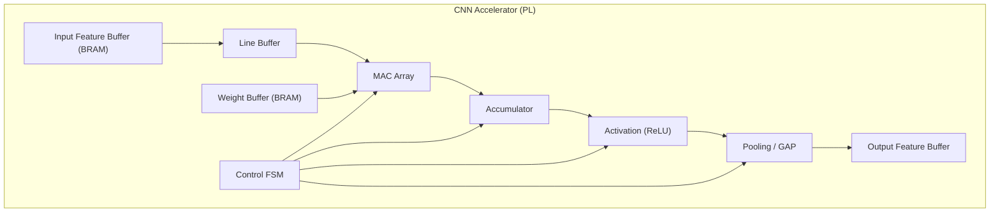
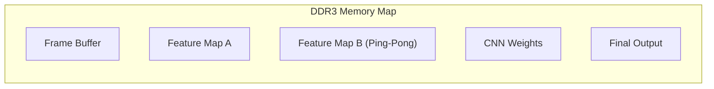
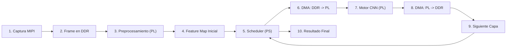
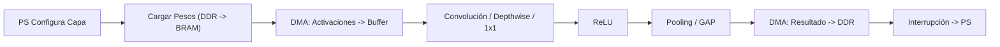
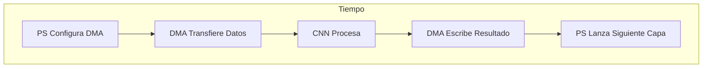

# BITACORA [ TRABAJO DE GRADO ]
---

En este archivo se busca llevar un registro del proceso que se tendra para realizar el trabajo de grado de forma que todo quede evidenciado, todos los requerimientos y lo que se llevara a cabo sera anotado en esta bitacora.

---

## BOARD ESCOGIDA

La board con la cual se trabajara a lo largo de este proceso, sera la *Puzhi 7020 Starlite Kit de evaluación Xilinx Zynq-7000 SoC XC7Z020 Placa de desarrollo FPGA ZYNQ 7000*, dicha placa se escogio principalmente por su costo, teniendo en cuenta que el proposito es trabajar con pequeños y medianos agricultores, no muchos cuentan con los recursos para adquirir hardware de mas capacidad, pero tambien se escogio ya que tiene un minimo de recursos para poder llevar a cabo la tarea principal que es la inferencia de redes neuronales convolucionales.


## ESPECIFICACIONES DE LA BOARD

* SoC Zynq 7020:
    + Arm Cortex-A9 MPCore de dos núcleos.
    + L1 Cache 32KB para Instrucciones, 32KB para Datos ( Por nucleo ).
    + L2 Cache 512KB.
    + Hasta 866 MHz.
    + 85k Celdas Logicas.
    + 4,9 Mb de BRAM.
    + 220 particiones de DSP.
    + 200 pines de E/S Maximos.
    + 53,2k LUTs.
    + 106,4k Flip-Flops.
* 512 MB de RAM DDR3.
* 64Kbit EEPROM.
* JTAG Downloader.
* SD Card Slot.
* MIPI CSI connector.
* $1$ $\times$ UART.
* $2$ $\times$ $40$ Pin Connector.

La placa tiene un precio de \$432.010 mas \$102.344,36 de envio en AliExpress que fue donde se adquirio.

## MODELOS DE CNN ESCOGIDAS

Como se menciono en las especificaciones de la board escogida, esta cuenta con recursos muy limitados dada las necesidades de los agricultores, teniendo en cuenta el hardware, entonces tambien se debe limitar los modelos CNN que se pueden montar en la board para que esta realice su tarea de inferencia de forma satisfactoria, por lo cual se opto por dos modelos, el primero es usando MobileNetV1 y en segundo caso un modelo propio que sera desarrollado desde cero para realizarlo a medida de las limitaciones con las cuales cuenta el hardware.

## LIMITACIONES DEL ACELERADOR

Dado que la placa tiene recursos muy limitados se necesita que la CNNs que se monten en el acelerador cumplan una serie de requisitos para que puedan ser ejecutadas de forma satisfactoria en la placa, algunas de estas fueron escogidas como diria el profe Carlos, por el criterio de Ingeniero, otras tienen una razon de ser, dichas limitaciones seran anumeradas a continuacion.

* Limitaciones a nivel de CNN ( Capas soportadas ):
    + Conv $3$ $\times$ $3$.
    + Conv $1$ $\times$ $1$.
    + Depthwise $3$ $\times$ $3$.
    + ReLU.
    + MaxPool $2$ $\times$ $2$.
    + Global Average Pool.
* Numero maximo de canales:
    + $C_{in} \leq 64$.
    + $C_{out} \leq 64$.
* Resolucion maxima de entrada de $96$ $\times$ $96$ o $128$ $\times$ $128$ con 3 canales RGB.
* Precision numerica de INT8, para los acumuladores INT32 y pesos cuantizados offline.
* Limitaciones a nivel de PL:
    + Un solo motor de convolucion, que sera reutilizado en el tiempo, dicho motor sera configurable por registros, y tendra modos Conv $3$ $\times$ $3$, Conv $1$ $\times$ $1$ y Depthwise $3$ $\times$ $3$.
    + Paralelismo moderado usando solo 8 o 16 MACs en paralelo.
    + BRAM solo para line buffers, Ventana $3$ $\times$ $3$, ping-pong buffers pequeños.
    + DDR como almacenamiento principal usandose para activaciones grandes y pesos por capa.
    + Usar una camara MIPI para la captura de imagenes.
* Pre-procesamiento:
    + Re-size a $96$ $\times$ $96$.
    + RGB.
    + Normalizacion simple.
    + Todo en INT8.

### Justificación de las limitaciones

Cada una de las limitaciones antes enumeradas que se le imponen al acelerador responden a restricciones reales del hardware seleccionado, así como a criterios de eficiencia y reutilizacion. Estas decisiones van a permitir implementar una arquitectura genérica, capaz de acelerar múltiples CNNs ligeras sin depender de un modelo específico, maximizando el aprovechamiento de los recursos del SoC.

## MACRO - ARQUITECTURA



En la macro-arquitectura podemos apreciar como se van a distribuir las tareas entre los distintos componentes del SoC, donde tenemos todo lo que hara el Processing System (PS), la Programmable Logic (PL), la Interconexion AXI, y la memoria DDR3.

### Processing System

* ARM-Cortex-A9 (Dual-Core)

    + Ejecuta la aplicacion principal.
    + Maneja la logica de alto nivel.
    + Toma desiciones ( inferencia, clasificacion, estados ).

    Nos interesa aprovechar los dos nucleos del chip, ya que de esta forma podemos asignar dichas tareas de forma equivalente para que la carga no sea de una sola unidad, de esta forma:

    + Core 0: control del sistema.
    + Core 1: gestion de inferencia / comunicacion.

* Runtime Bare-Metal (Control & Concurrency)

    + Coordina tareas entre nucleos.
    + Ligero para no depender de un OS completo.
    + Control determinista del hardware.

    De esta forma las tareas se podrian repartir de la siguiente manera:
    
    + Core 0:
        - Configurar camara.
        - Manejar interrupciones.
        - Coordinar DMA.
    + Core 1:
        - Scheduler de la CNN.
        - Lanzar capas al acelerador.
        - Leer resultados.

* Drivers AXI / DMA

    + Abstraccion del hardware.
    + Escritura / Lectura de los registros AXI-Lite.
    + Configuracion de transferencia DMA.

    Este bloque realmente viene a ser como el puente entre PS y PL.

---
### Interconexion AXI

* AXI-Lite (Control)

    + Configurar el acelerador CNN.
    + Seleccionar tipo de capa.
    + Direcciones base.
    + Dimensiones.
    + Flags start / done.

* AXI-Hp (High Performance)

    + Activaciones.
    + Pesos.
    + Feature maps.
    + Transferencias grandes.

---
### Programmable Logic

* MIPI CSI RX

    + Captura continua de imagenes.
    + Conversion a stream interno.

* Pre-processsing

    + Resize.
    + Normalizacion simple.
    + Conversion a INT8.
    + Reordenamiento de datos.

* CNN Accelerator

    + Convoluciones.
    + Depthwise.
    + Pooling.
    + Activacion.

* DMA Engine

    + Mover datos entre DDR <-> PL.
    + Sin intervencion del CPU.
    + Maximo throughput.

---
### DDR3 (512MB)

* Frames de camara.
* Feature maps intermedios.
* Pesos por capa.


Como se ha venido mencionando, el SoC Zynq-7020 cuenta con un procesador ARM Cortex-A9 de dos núcleos, debido a esto se opto por implementar un runtime bare-metal ligero que permitiera la ejecución paralela de tareas críticas sin la sobrecarga de un sistema operativo completo.

Esta decisión permite separar responsabilidades entre nucleos, reducir la latencia en la comunicación con la lógica programable, lo cual es bastante relevante en aplicaciones de inferencia en tiempo real.

## BAJANDO UN NIVEL MAS PROFUNDO

Para ver un mayor enfoque de que funcion cumplira cada bloque de la macro-arquitectura, necesitamos entonces ver mas a profundidad que realizara cada uno de estos:











## PIPELINE DE FRAMES

Una vez que se ha visto como sera la macro-arquitectura, entonces podemos avanzar algo mas y ver el flujo del pipeline de datos:


En este primer diagrama podemos observar:

* Frame adquirido por la camara MIPI que se escribe en memoria.
* Ese frame se lee de la memoria, se preprocesa, una vez sale de memoria se borra de memoria para poder liberar espacio.
* Se reutiliza el mismo motor por capa.
* Los resultados intermedios se van guardando en la memoria.
* El PS actua como un scheduler, decidiendo que operacion se ejecuta en cada momento en ell acelerador, y como se usan los recursos, esto se puede ejemplificar con algo muy sencillo como lo siguiente:

```C
for( layer = 0; layer < num_layers; layer++ ) {
    configure_parameters( layer );
    launch_DMA_input( );
    launch_accelerator( );
    wait_interruption( );
}
```

* Se define el resultado final.


En este diagrama podemos ver como es el pipeline interno por cada capa.

* El PS no procesa datos.
* DDR actúa como almacenamiento intermedio.
* Hay separación clara entre:
    + Control.
    + Transferencia.
    + Computación.

