# BITACORA [ TRABAJO DE GRADO ]
---

En este archivo se busca llevar un registro del proceso que se tendra para realizar el trabajo de grado de forma que todo quede evidenciado, todos los requerimientos y lo que se llevara a cabo sera anotado en esta bitacora.

---

## CONTEXTO Y LIMITACIONES

### BOARD SELECCIONADA

La board con la cual se trabajara a lo largo de este proceso, sera la *Puzhi 7020 Starlite Kit de evaluación Xilinx Zynq-7000 SoC XC7Z020 Placa de desarrollo FPGA ZYNQ 7000*, dicha placa se escogio principalmente por su costo, teniendo en cuenta que el proposito es trabajar con pequeños y medianos agricultores, no muchos cuentan con los recursos para adquirir hardware de mas capacidad, pero tambien se escogio ya que tiene un minimo de recursos para poder llevar a cabo la tarea principal que es la inferencia de redes neuronales convolucionales.

### ESPECIFICACIONES DE LA BOARD

* SoC Zynq 7020:
    + Arm Cortex-A9 MPCore de dos núcleos.
    + L1 Cache 32KB para Instrucciones, 32KB para Datos ( Por nucleo ).
    + L2 Cache 512KB.
    + Hasta 866 MHz.
    + 85k Celdas Logicas.
    + 4,9 Mb de BRAM.
    + 220 particiones de DSP.
    + 200 pines de E/S Maximos.
    + 53,2k LUTs.
    + 106,4k Flip-Flops.
* 512 MB de RAM DDR3.
* 64Kbit EEPROM.
* JTAG Downloader.
* SD Card Slot.
* MIPI CSI connector.
* $1$ $\times$ UART.
* $2$ $\times$ $40$ Pin Connector.

La placa tiene un precio de \$432.010 mas \$102.344,36 de envio en AliExpress que fue donde se adquirio.

### MODELOS DE CNN ESCOGIDA

Como se menciono en las especificaciones de la board escogida, esta cuenta con recursos muy limitados dada las necesidades de los agricultores, teniendo en cuenta el hardware, entonces tambien se debe limitar los modelos CNN que se pueden montar en la board para que esta realice su tarea de inferencia de forma satisfactoria, por lo cual se opto por el modelo MobileNetV1.

### LIMITACIONES DEL ACELERADOR

Dado que la placa tiene recursos muy limitados se necesita que la CNNs que se monten en el acelerador cumplan una serie de requisitos para que puedan ser ejecutadas de forma satisfactoria en la placa, algunas de estas fueron escogidas como diria el profe Carlos, por el criterio de Ingeniero, otras tienen una razon de ser, dichas limitaciones seran anumeradas a continuacion.

* Limitaciones a nivel de CNN ( Capas soportadas ):
    + Conv $3$ $\times$ $3$.
    + Pointwise $1$ $\times$ $1$.
    + Depthwise $3$ $\times$ $3$.
    + ReLU.
    + Pool Layer $2$ $\times$ $2$ ( opcional dependiendo de la capa ).
    + Global Average Pool ( opcional dependiendo de la capa ).
* Numero maximo de canales:
    + $C_{in} \leq 64$.
    + $C_{out} \leq 64$.
* Resolucion maxima de entrada de $96$ $\times$ $96$ con 3 canales RGB.
* Precision numerica de INT8, para los acumuladores INT32 y pesos cuantizados offline.
* Limitaciones a nivel de PL:
    + Un solo motor de convolucion, que sera reutilizado en el tiempo, dicho motor sera configurable por registros, y tendra modos Conv $3$ $\times$ $3$, Conv $1$ $\times$ $1$ y Depthwise $3$ $\times$ $3$.
    + Paralelismo usando solo 16 MACs en paralelo, donde cada MAC procesara un filtro de cada capa, dado que se usa Dpethwise entonces realmente es un MAC para cada canal.
    + BRAM solo para line buffers, Ventana $3$ $\times$ $3$, ping-pong buffers pequeños.
    + DDR como almacenamiento principal usandose para activaciones grandes y pesos por capa.
    + Usar una camara MIPI para la captura de imagenes.
* Pre-procesamiento:
    + Re-size a $96$ $\times$ $96$.
    + RGB.
    + Normalizacion simple.
    + Todo en INT8.
* Dataflow:
    Cuando se habla del datafow en una CNN, estamos hablando sobre como es el flujo de datos ( input data, weights y partial sums ) atravez del hardware sobre el cual esta corriendo, buscando que haya la mayor optimizacion posible entre la memoria y los elementos de procesamiento, normalmente se tienen los tipos weight stationary, output stationary, input stationary, and row stationary.
    + Weight Stationary: 
    Carga los pesos en los elementos de procesamiento (PEs por sus siglas en ingles), guardandolos ahi, esto minimizando el costo de energia de leer pesos desde la memoria.
    + Output Stationary:
    Se centra en acumular sumas parciales dentro de los PE, lo que reduce la necesidad de leer/escribir frecuentemente sumas parciales en el buffer global.
    + Input Stationary:
    Mantiene las input activations estacionarias en los PE para maximizar la reutilización.
    + Row Stationary:
    Optimiza la eficiencia energética al maximizar la reutilización de ambas filas de datos de entrada y de filtro, a menudo considerados altamente eficientes.

    Para este proyecto, se considero que la opcion mas pertinente es usar Output Stationary, esto debido a que la parte mas costosa del computa en una CNN es hacer la convolucion, por lo que es muy pertinente mantener los acumuladores en los PEs, de esta forma reduciendo la necesidad de escribir/leer del buffer global, evitando accesos a memoria de forma recurrente para almacenar los resultados de las sumas parciales.
* Estrategia de Memoria:
    Como se mostrara mas adelante en la macro-arquitectura del sistema, se pretende guardar weights y feature maps en la memoria RAM DDR3, pero eso implica que se cada vez que se desea procesar una nueva imagen se debe cargar completamente desde la RAM hacia el acelerador, y despues los mapas de caracteristicas resultantes vueltos a guardar en memoria, esto hace que el sistema gaste muchos ciclos escribiendo/leyendo de la memoria, generando un cuello de botella, donde el rendimiendo deja de ser el computo que se debe a realizar a nada mas que escrituras y lecturas de memorias recurrentes, para solucionar este problema se propone lo siguiente:
    + LineBuffer en BRAM:
    Es tecnica es muy utilizada en porcesamiento de imagenes en FPGAs, es una estructura de memoria que utiliza los Block RAM del FPGA, diseñada para almacenar una o mas lineas horizontales de datos de video o imagenes, actuando como un puente entre los datos de entrada y los algoritmos de procesamiento paralelo, la idea de usar esta estrategia es que idealmente se pueden tener 3 LineBuffers a nivel interno, esto porque para convoluciones $3$ $\times$ $3$, se necesitan procesar los 3 pixeles de la linea actual, los 3 superiores y los 3 inferiores, de esta forma podemos ahorrarnos la necesidad de almacenar frames completos en memoria, e ir procesandolos sin tantas lecturas de memoria.
    + Tiling Espacial:
    El tiling espacial ( o teselado ) es una estrategia muy utilizada en graficos por computadora para dividir datos espaciales extensos en bloques rectangulares mas pequeños y manejables. Esto permite cargar, visualizar y procesar mapas complejos de forma rapiday eficiente. La idea de utilizar tiling espacial es no procesaro todas las imagenes de golpe, sino procesar por bloques de filas, de esta forma reducimos la carga en el buffer interno y podemos mantener un pipeline mucho mas estable. 


### Justificación de las limitaciones

Cada una de las limitaciones antes enumeradas que se le imponen al acelerador responden a restricciones reales del hardware seleccionado, así como a criterios de eficiencia y reutilizacion. Estas decisiones van a permitir implementar una arquitectura genérica, capaz de acelerar múltiples CNNs ligeras, maximizando el aprovechamiento de los recursos del SoC.

Explicando un poco mas el porque se decidio escoger el modelo MobileNetV1, se debe mencionar como funciona una CNN a nivel interno, donde una CNN esta compuesta por una capa de entrada, una de salida y un conjunto de capas ocultas entre ambas, cada capa se caracteriza por tener un numero definido de filtros o kernels, donde estos filtros/kernels realizan lo que es llamada una conovolucion, al terminar se genera lo que se llama un mapa de caracteristicas, el cual resalta la presencia de caracteristicas especiales de la imagen, adicional este mapa de caracteristicas sirve como entrada para la siguiente capa de la CNN, escencialmente las CNN estan compuestas de muchas otras capas, no solo convolucionales, las cuales cumplen otras funciones ademas de la deteccion de caracteristicas, algunas de estas capas son:

* Pooling Layer:
Escencialmente siempre se pone una capa de pooling despues de una capa convolucional, ya antes descrita, esto porque se busca reducir la dimensionalidad de el mapa de caracteristicas obtenido en la capa convolucional anterior, pero reteniendo la informacion mas relevante, en una CNN esto es reducir el numero de pixeles usado para representar la imagen. La forma mas tipica de una capa de pooling es la llamada Max Pooling, la cual consiste en mantener el valor maximo dentro de una ventana determinada, es decir el tamaño del kernel, mientras descarta otros valores, tambien existen otras tecnicas como average pooling, la cual no toma el valor maximo dentro de la ventana, sino que toma un promedio de entre todos los valores de la ventana.

* Fully Connected Layer:
Esta capa tiene gran relevancia en las etapas finales de la CNN, donde es la responsable de clasificar imagenes basadas en las caracteristicas in las capas previas, el termino "fully connected" significa que cada neurona en una capa esta conectada a cada neurona de la siguiente capa.

La capa fully connected integra las diversas características extraídas en las capas convolucionales y de pooling anteriores y las asigna a clases o resultados específicos. Cada entrada de la capa anterior se conecta a cada unidad de activación en la capa fully connected, lo que permite que la CNN considere simultáneamente todas las características al tomar una decisión de clasificación final.

No todas las capas de una CNN están completamente conectadas. Debido a que las capas fully connected tienen muchos parámetros, aplicar este enfoque en toda la red crea una densidad innecesaria, aumenta el riesgo de sobreajuste y hace que la red sea costosa de entrenar en términos de memoria y computación. Limitar el número de capas fully connected equilibra la eficiencia computacional y la capacidad de generalización con la capacidad de aprender patrones complejos.

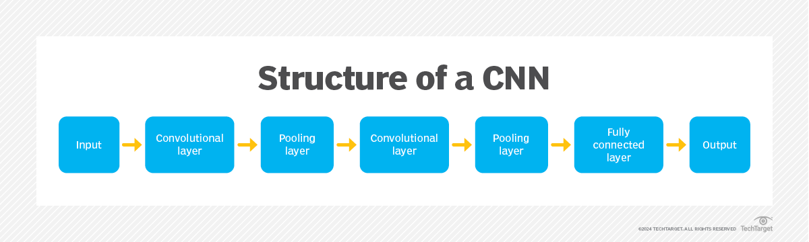

Despues de entender un poco como esta compuesta una CNN tradicional, las cuales pueden incluir otras capas ademas de las mencionadas dependiendo del modelo, la idea es explicar entonces porque se decidio trabajar con el modelo MObileNetV1, esto se debe a que una CNN tradicional debe procesar todos canales o mapas de caracteristicas que se hayan obtenido en la capa anterior, entonces si nuestros mapas de caracteristicas son al momento de entrar en una nueva capa por ejemplo 16, entonces estos 16 mapas se procesan al tiempo por cada uno de los filtros de la capa a la cual estan entrando, esto quiere decir que si tenemos en esta capa 16 filtros/kernels, entonces los 16 mapas son convolucionados con cada uno de los 16 filtros, dado que cada filtro se aplica a cada uno de los mapas o tambien llamados canales cuando ya son entradas de una capa, esto produce que por cada canal se obtendran 16 nuevos canales, como son 16 canales, pues en total obtendriamos $16$ $\times$ $16$ mapas de caracteristicas en la salida de esta capa, lo cual incrementa demasiado los canales de entrada que tendra la siguiente capa, de ahi viene una de las limitaciones impuestas y es que los canales de entrada y salida deberan estar limitados a menos o igual a 64.

Entonces una vez entendido este panorama, se puede proceder a explicar lo que significa que el acelerador soportar Depthwise Separable Convolutions, esta es una estrategia que consiste en dos pasos, primero la operacion DespthWise y consecuente a esta la operacion PointWise, donde en lugar de aplicar todos los filtros de una capa a cada canal de entrada de forma simultanea, lo que se hace es convolucionar cada canal con un solo filtro de la capa, esto reduce las operaciones que se deben hacer por cada kernel, y ademas como se aplica un filtro por canal de entrada, entonces solo se produce un mapa de caracteristicas por cada canal de entrada, esto significa que a la salida de la capa tendremos que $C_{in} = C_{out}$. Despues de realizar la operacion DepthWise se procede a realizar la operacion PintWise $1$ $\times$ $1$, esta se encarga de combinar las salidas de la capa, de esta forma obteniendo los mapas de caracteristicas que se debian haber obtenido si hubieramos hecho una convolucion normal.

### Processing System

* ARM-Cortex-A9 (Dual-Core)

    + Ejecuta la aplicacion principal.
    + Maneja la logica de alto nivel.
    + Toma desiciones ( inferencia, clasificacion, estados ).

    Nos interesa aprovechar los dos nucleos del chip, ya que de esta forma podemos asignar dichas tareas de forma equivalente para que la carga no sea de una sola unidad, de esta forma:

    + Core 0: control del sistema.
    + Core 1: gestion de inferencia / comunicacion.

* Runtime Bare-Metal (Control & Concurrency)

    + Coordina tareas entre nucleos.
    + Ligero para no depender de un OS completo.
    + Control determinista del hardware.

    De esta forma las tareas se podrian repartir de la siguiente manera:
    
    + Core 0:
        - Configurar camara.
        - Manejar interrupciones.
        - Coordinar DMA.
    + Core 1:
        - Scheduler de la CNN.
        - Lanzar capas al acelerador.
        - Leer resultados.

* Drivers AXI / DMA

    + Abstraccion del hardware.
    + Escritura / Lectura de los registros AXI-Lite.
    + Configuracion de transferencia DMA.

    Este bloque realmente viene a ser como el puente entre PS y PL.

---
### Interconexion AXI

* AXI-Lite (Control)

    + Configurar el acelerador CNN.
    + Seleccionar tipo de capa.
    + Direcciones base.
    + Dimensiones.
    + Flags start / done.

* AXI-Hp (High Performance)

    + Activaciones.
    + Pesos.
    + Feature maps.
    + Transferencias grandes.

---
### Programmable Logic

* MIPI CSI RX

    + Captura continua de imagenes.
    + Conversion a stream interno.

* Pre-processsing

    + Resize.
    + Normalizacion simple.
    + Conversion a INT8.
    + Reordenamiento de datos.

* CNN Accelerator

    + Convoluciones.
    + Depthwise.
    + Pooling.
    + Activacion.

* DMA Engine

    + Mover datos entre DDR <-> PL.
    + Sin intervencion del CPU.
    + Maximo throughput.

---
### DDR3 (512MB)

* Frames de camara.
* Feature maps intermedios.
* Pesos por capa.


Como se ha venido mencionando, el SoC Zynq-7020 cuenta con un procesador ARM Cortex-A9 de dos núcleos, debido a esto se opto por implementar un runtime bare-metal ligero que permitiera la ejecución paralela de tareas críticas sin la sobrecarga de un sistema operativo completo.

Esta decisión permite separar responsabilidades entre nucleos, reducir la latencia en la comunicación con la lógica programable, lo cual es bastante relevante en aplicaciones de inferencia en tiempo real.

## MACRO - ARQUITECTURA

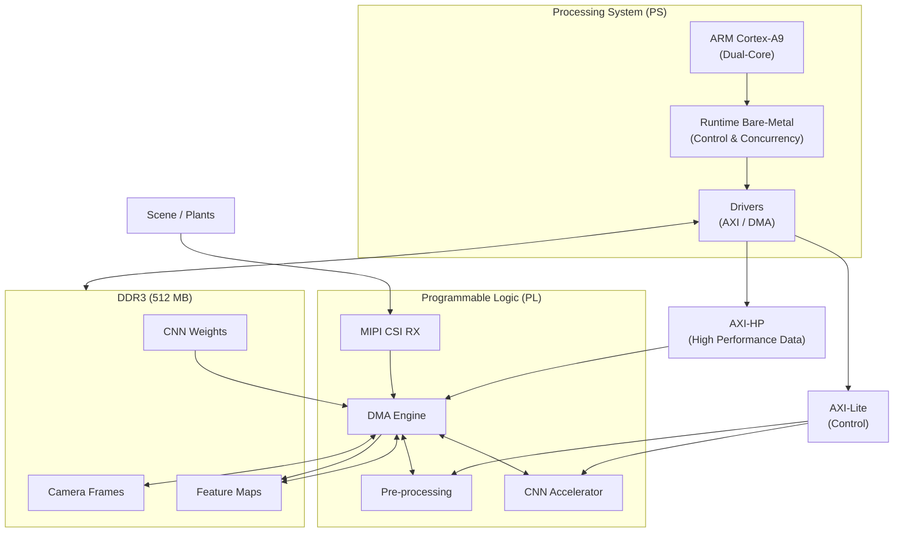

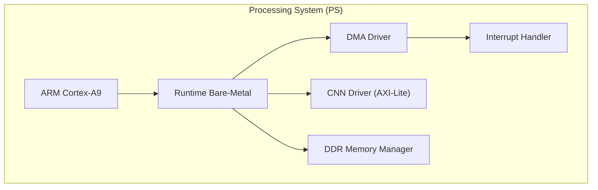

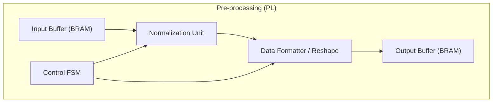

En la macro-arquitectura podemos apreciar como se van a distribuir las tareas entre los distintos componentes del SoC, donde tenemos todo lo que hara el Processing System (PS), la Programmable Logic (PL), la Interconexion AXI, y la memoria DDR3.

## ARQUITECTURA INTERNA DEL CNN ACCELERATOR

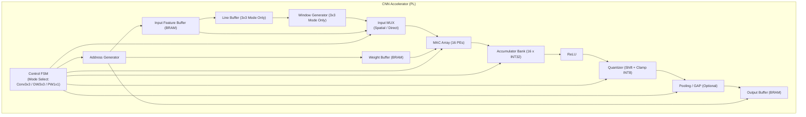

Como se explico anteriormente, el acelerador soportara 3 modos de convolucion, conv normal $3$ $\times$ $3$, DepthWise $3$ $\times$ $3$ y PointWise $1$ $\times$ $1$, por eso es necesario que la FSM del acelerador sepa que señales enviar dependiendo del modo en el cual se encuentre de la capa, para todos los modos primero se debe pasar por el [Address Generator], este se encargar de calcular direcciones de memoria, de esta forma se controla:

* Que posicion $(x, y)$ de los feature maps estoy procesando.
* Que canal es el que estoy leyendo.
* Que filtro estoy usando.
* Donde guardo el resultado.

Despues de esto esta el bloque [Input Feature Buffer], es simplemente un bloque que guarda Feature Maps de entrada de la capa actual, este bloque solo obedece lo que el [Address Generator] le diga, de forma que el [Addrees Generator] pide el dato en la direccion X, y el [Input Feature Buffer] lo entrega.

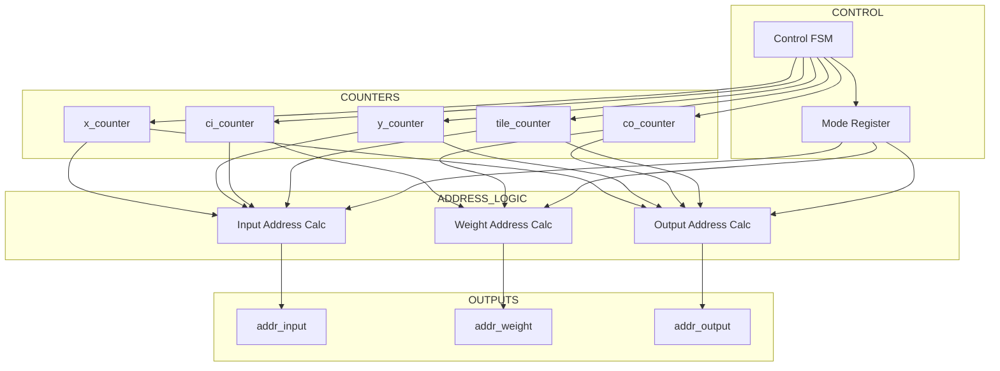

Para las convoluciones $3$ $\times$ $3$, es decir conv normales y DepthWise, entonces esta el [Line Buffer], este recibe los datos que el [Address Generator] le pidio al [Input Buffer], este entrega los datos pedidos y [Line Buffer] los organiza en filas para asi evitar leer recurrentemente de la memoria.

Despues tenemos el bloque de [Window Generator] el cual recibe las filas que armo el [Line Buffer] y lo entrega como una ventana de $3$ $\times$ $3$, es decir, el [Line Buffer] unicamente guardar las filas, pero para que los MACs puedan entender con que pixel trabajaran, entonces necesitan la ventana exacta con la cual trabajaran, de esto se encargar el [Window Generator].

Esto que se explico es para los modos $3$ $\times$ $3$, para el caso de las conv $1$ $\times$ $1$ no necesitamos ventanas, unicamente necesitamos los pesos de un pixel $(x, y)$ en cada feature map que esta entrando en la capa, entonces lo que sucedera es que el [Address Generator] fijara el pixel $(x, y)$ al cual se esta haciendo convolucion en este momento, y entregara todas las activaciones de cada feature map en ese pixel y esos valores pasan directos al MAC, por eso el [Input Buffer] que es quien tiene todas las activaciones de los feature maps esta conectado directamente al mux.

Hablando del Mux, este bloque [Input Mux] es simplemente un multiplexor que dejara pasar las ventas que genero el [Window Generator] o las activaciones que vienen directo del [Input Buffer], dependiendo del modo de convolucion que se este operando, sera la FSM quien generara la señal que escoge a quien debe dejar pasar.

Siguiendo tenemos el [Weight Buffer] que es simplemente parte de la BRAM donde se guardaron los pesos de cada kernel, aqui es importante el [Address Generator] ya que es quien le dice al [Weight Buffer]:
* Que peso debe entrar al MAC.
* De que filtro es ese peso.
* A que canal corresponde hacer convolucion ese peso del filtro.

Tenemos el [MAC Array] el cual es un arreglo de 16 MACS que trabajaran en paralelo dependiendo del modo en el cual este el acelerador en ese momento, cada MAC realiza la operacion de convolucion de un kernel con su respectivo canal en caso de DepthWise $3$ $\times$ $3$, de esta forma estamos usando un MAC por canal, o haciendo paralelismo sobre canales, para este caso cada MAC debera realizar $3$ $\times$ $3$ $\times$ $1$ multiplicaciones, sumar el resultado de esas multiplicaciones y guardarlas en su respectivo acumulador que esta en el bloque de [Accumulator Bank]. En caso de conv $3$ $\times$ $3$ normal, entonces los MACs se usan de forma que hacemos paralelismo sobre $C_{out}$, es decir como en convoluciones normales, los filtros se aplican sobre todos los canales de entrada entonces podemos hacer que cada MAC haga las operaciones correspondientes para cada filtro, en este caso los filtros/kernels no son realmente $3$ $\times$ $3$, sino mas bien $3$ $\times$ $3$ $\times$ $C_{in}$, ya que el kernel debe tener progundidad igual al numero de canales de entrada, por lo tanto no tiene solo $9$ pesos sino $3$ $\times$ $3$ $\times$ $C_{in}$, por lo que para este modo, cada MAC tambien debe realizar $3$ $\times$ $3$ $\times$ $C_{in}$ multiplicaciones, luego como ya se explico, sumar el resultado de estas multiplicaciones y guardarlas en sus respectivo acumulador del [Accumulator Bank], escencialmente se propone tener tantos acumuladores como MACs en el array, ya que asi cada MAC tiene un acumulador siempre disponible para su uso.

En el [Accumulator Bank] como ya se explico, simplemente se guarda el resultado de cada una de las convoluciones hechas previamente por cada uno de los MACs.

[ReLU], [Quant] y [Pool] son simplemente bloque de post-procesamiento, [ReLU] es la funcion de activacion, [Quant] se encarga de cuantizar el valor final en INT8 y [Pool] es un bloque opcional dependiendo de la capa, el cual se encarga de reducir la dimensionalidad del feature map obtenido.

[Output Buffer] es nuevamente parte de BRAM donde se guarda el feature map ya procesado, el [Address Generator] se encarga de decirle en que direccion debe guardar el Feature Map.

Una vez entendidos todos los bloques, el flujo para una convolucion $3$ $\times$ $3$ es el siguiente:

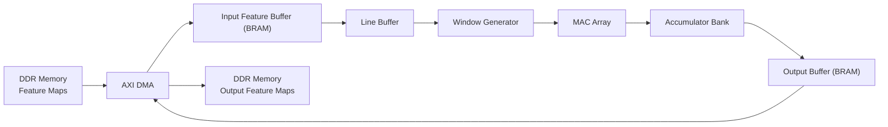

```mermaid
flowchart LR
    DDR_IN["DDR3\nFeature Maps (entrada)"]
    DMA_IN["DMA\n(DDR → BRAM)"]
    IN_BUF["Input Feature Buffer\n(BRAM)"]
    LINE["Line Buffer\n(3x3 mode)"]
    WIN["Window Generator\n(3x3 mode)"]
    MUX["Input MUX\n(Spatial / Direct)"]
    W_BUF["Weight Buffer\n(BRAM)"]
    MAC["MAC Array\n(16 PEs)"]
    ACC["Accumulator Bank\n(16 x INT32)"]
    RELU["ReLU"]
    QUANT["Quantizer\n(INT8)"]
    POOL["Pooling / GAP\n(Opcional)"]
    OUT_BUF["Output Buffer\n(BRAM)"]
    DMA_OUT["DMA\n(BRAM → DDR)"]
    DDR_OUT["DDR3\nFeature Maps (salida)"]

    DDR_IN --> DMA_IN --> IN_BUF
    IN_BUF --> LINE --> WIN --> MUX
    IN_BUF --> MUX
    W_BUF --> MAC
    MUX --> MAC --> ACC --> RELU --> QUANT --> POOL --> OUT_BUF
    OUT_BUF --> DMA_OUT --> DDR_OUT
```

Para el caso de conv 1×1, el flujo simplificado es:

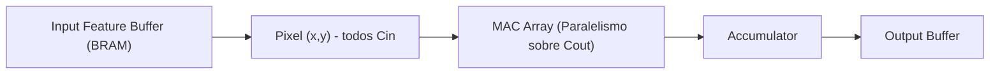

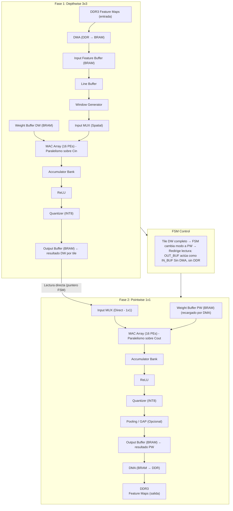

## ESTRATEGIA DE MEMORIA

Para ver un mayor enfoque de que funcion cumplira cada bloque de la macro-arquitectura, necesitamos entonces ver mas a profundidad que realizara cada uno de estos:

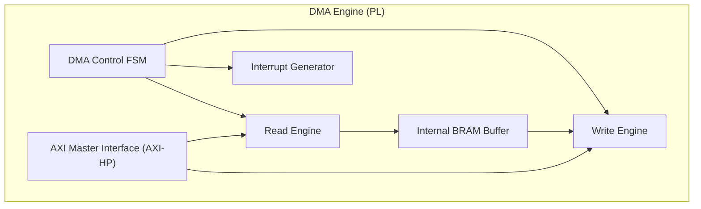

Una vez comprendido que realizara cada bloque en esta seccion entonces se debe explicar la estrategia de carga y gestion de pesos, como se mostro inicialmente, los pesos de cada capa estaran originalmente almacenados en la DDR por lo que debemos traerlos a BRAM para poder trabajar con ellos sin leer de forma recurrente en memoria, para esto, antes de iniciar el procesamiento de una capa:

* El procesador configura la transferencia de los pesos mediante el DMA.
* Los pesos correspondientes a la capa se cargan al [Weight Buffer].

Dado por la limitaciones que se impusieron que $C_{in}, C_{out} \leq$ $64$, el peor caso para una etapa PointWise donde las convoluciones son $1$ $\times$ $1$ es:

$64$ $\times$ $64$ $=$ $4096$ pesos, que al estar cuantizados en INT8, eso nos da aproximadamente $4$ KB, lo cual es compatible con la capacidad disponible de BRAM en el SoC.

Para capas con $C_{out}$ $>$ $16$, los pesos se cargan en bloques de 16 filtros por iteración, reduciendo el requerimiento de almacenamiento simultáneo.

Tambien para aclarar lo que se menciono antes en las estrategias de memoria sobre el tiling espacial y la generacion de direcciones, tenemos que tener en cuenta la limitacion de BRAM, por lo que el proesamiento se realiza por tiles espaciales y/o por bloques de canales.

Para esto el [Address Generator] es responsable de:

* Generar direcciones de lectura de activaciones.
* Generar direcciones de lectura de pesos.
* Generar direcciones de escritura de feature maps de salida.
* Gestionar contadores de:
    + Coordenadas espaciales $(x, y)$.
    + Canal de entrada $C_i$.
    + Canal de salida $C_o$.
    + Indice del tile.

El procesamiento por tiles permite:
* Reducir la cantidad de datos simultaneamente alamcenados en BRAM.
* Mantener alta reutilización local.
* Disminuir transferencias frecuentes a DDR.

El tamaño del tile se define en función de la capacidad disponible de BRAM.


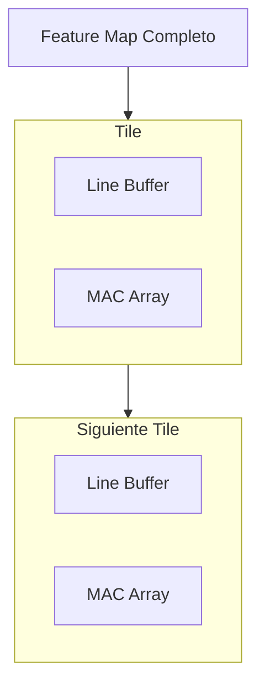

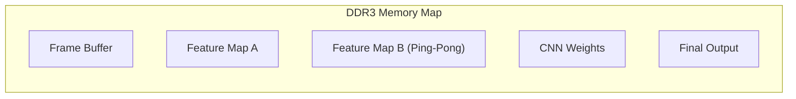

Dado que la BRAM es el recurso más crítico del diseño, es necesario verificar que la suma de todos los buffers internos del acelerador no exceda la capacidad disponible del SoC. A continuacion se presenta el consumo estimado de BRAM para el peor caso, es decir, con $C_{in}$ $=$ $C_{out}$ $=$ $64$ y tiles de $96$ $\times$ $16$.

| Buffer | Cálculo | Tamaño estimado |
|---|---|---|
| LineBuffers (3 líneas × 96 píxeles × 64 canales × 1B) | $3 \times 96 \times 64$ | ~18 KB |
| Input Feature Buffer (tile 96×16×64) | $96 \times 16 \times 64$ | ~96 KB |
| Weight Buffer (peor caso Pointwise 64×64) | $64 \times 64$ | ~4 KB |
| Output Buffer (tile 96×16×64, reutilizado DW→PW) | $96 \times 16 \times 64$ | ~96 KB |
| Window Buffer (ventana 3×3 × 64 canales) | $9 \times 64$ | < 1 KB |
| **Total** | | **~214 KB** |

La Zynq-7020 dispone de 4.9 Mb de BRAM eso es aproximadamente $612.5 KB$, por lo que el consumo estimado representa aproximadamente el $34.9 \%$ del total disponible. Este margen amplio valida las decisiones de diseño tomadas y además deja espacio suficiente para los buffers internos del DMA Engine y el bloque de Pre-processing, sin comprometer la disponibilidad de BRAM para otros bloques de la PL.

Vale la pena resaltar que el [Output Buffer] cumple una doble función: 
* Almacena el resultado del Depthwise y actúa como [Input Buffer] del Pointwise en el flujo fusionado DW→PW. Esto elimina la necesidad de un buffer intermedio dedicado, ahorrando aproximadamente 96 KB adicionales de BRAM respecto a una implementación naive con buffers separados.

## PIPELINE DE FRAMES

Una vez que se ha visto como sera la macro-arquitectura, entonces podemos avanzar algo mas y ver el flujo del pipeline de datos:

```mermaids

flowchart LR

    CAP["1. Captura MIPI"]
    DDRF["2. Frame en DDR"]
    PRE["3. Pre-processing (PL)"]
    FM0["4. Feature Map Inicial"]
    SCH["5. Scheduler (PS)"]
    DMA_IN["6. DMA: DDR -> PL"]
    CNN["7. CNN Accelerator (PL)"]
    DMA_OUT["8. DMA: PL -> DDR"]
    NEXT["9. Siguiente Capa"]
    RES["10. Resultado Final"]

    CAP --> DDRF
    DDRF --> PRE
    PRE --> FM0
    FM0 --> SCH
    SCH --> DMA_IN
    DMA_IN --> CNN
    CNN --> DMA_OUT
    DMA_OUT --> NEXT
    NEXT --> SCH
    SCH --> RES
```
En este primer diagrama podemos observar:

* Frame adquirido por la camara MIPI que se escribe en memoria.
* Ese frame se lee de la memoria, se preprocesa, una vez sale de memoria se borra de memoria para poder liberar espacio.
* Se reutiliza el mismo motor por capa.
* Los resultados intermedios se van guardando en la memoria.
* El PS actua como un scheduler, decidiendo que operacion se ejecuta en cada momento en ell acelerador, y como se usan los recursos, esto se puede ejemplificar con algo muy sencillo como lo siguiente:

```C
for( layer = 0; layer < num_layers; layer++ ) {
    configure_parameters( layer );
    launch_DMA_input( );
    launch_accelerator( );
    wait_interruption( );
}
```

* Se define el resultado final.

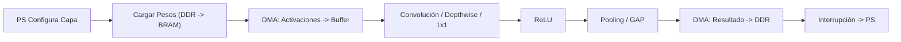
En este diagrama podemos ver como es el pipeline interno por cada capa.

* El PS no procesa datos.
* DDR actúa como almacenamiento intermedio.
* Hay separación clara entre:
    + Control.
    + Transferencia.
    + Computación.

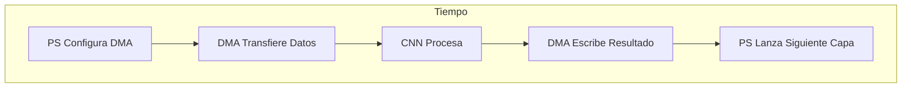

## Estimacion Teorica del Modelo

Para una capa conovolucional normal de $3$ $\times$ $3$:

Las multiplicaciones totales que se deben hacer son:

$H \times W \times C_{in} \times C_{out} \times 9$.

Donde:
$H:$ Altura del Feature Map.
$W:$ Ancho del Feature Map.
$C_{in}:$ Canales de entrada.
$C_{out}:$ Canales de salida.
Con 16 PEs operando en paralelo entonces tenemos un estimado de ciclos igual a $(H \times W \times C_{in} \times C_{out} \times 9) / 16$

Para una capa $1$ $\times$ $1$:

Las multiplicaciones totals que se deben hacer son:
$H \times W \times C_{in} \times C_{out}$

Con 16 PEs operando en paralelo entonces tenemos un estimado de ciclos igual a $(H \times W \times C_{in} \times C_{out}) / 16$

Estas estimaciones no consideran latencias de memoria ni sobrecarga de control, pero permiten obtener una cota inferior del tiempo de ejecución.