# ANALSIS DE RESULTADOS DE ENTRENAMIENTO

Para validar las restricciones impuestas en el acelerador, sobre la resolucion de imagenes y la cuantizacion a INT8, se desarrollo el modelo de CNN que tendra la tarea de indentificar enfermedades en una planta de tomate, para esto se empleo el database de PlantVillage alojado en Kaggle, link = "https://www.kaggle.com/datasets/emmarex/plantdisease/data".

## ESTRATEGIA DE VALIDACIÓN

Para hacer una analisis completo y detallado de que ocurre en distintos escenarios y asi ver que posibles resultados obtener se planteo el siguiente esquema:

* Realizar entrenamientos del modelo en $3$ resoluciones distintas, las cuales son [ $256$ $\times$ $256$, $128$ $\times$ $128$, $96$ $\times$ $96$ ].
* Para cada entrenamiento obtenido anteriormente se realizan las siguientes cuantizaciones [ "float32", "int16", "int8" ].
* En cada cuantizacion obtenida se usan como metricas el accuracy y confussion matrix.

## IMPLEMENTACION

Para poder realizar una correcta implementacion del modelo, primero se necesitaba balancear el database, ya que para cada una de las clases habia muestras muy disparejas, originalmente el database contaba con $10$ clases, las cuales eran:

* Tomato_Bacterial_Spot.
* Tomato_Early_Blight.
* Tomato_Late_Blight.
* Tomato_Leaf_Mold.
* Tomato_Septoria_Leaf_Spot.
* Tomato_Spider_Mites_Two_Spotted_Spider_Mite.
* Tomato__Target_Spot.
* Tomato__Tomato_YellowLeaf__Curl_Virus.
* Tomato__Tomato_Mosaic_Virus.
* Tomato_Healthy.

Se tomo la desicion de descartar la clase "Tomato__Tomato_Mosaic_Virus" debido a que tenia significativamente muchas menos muestras que las demas clases, y tomar esta clase como referencia para el balance provocaria una perdida enorme de informacion de las demas clases, obteniendo un entrenamiento muy pobre, por lo tanto se decidio eliminarlo definitivamente.

Despues de esto entonces se tomo como clase referencia la clase "Tomato_Leaf_Mold" la cual tenia un total de $952$ muestras, por lo que todas las demas clases debian ser recortadas hasta obtener este mismo numero de muestras, pero antes de hacer eso, se decicio con ayuda de un script en python tomar 48 muestras aleatorias de la clase "Tomato_Leaf_Mold" y aplicarle ciertas transforamciones muy poco invasivas, ya sean como hacer espejo, cambiar algunos tonos de luz o rotar un poco las imagenes, esto con el proposito de alcanzar $1000$ muestras para esta clase, de esta forma entonces, cada clase debia recortarse a $1000$ muestras.

Una vez que el dataset fue balanceado, entonces ahora si se procedio a realizar el script en python que realizaria las siguientes tareas:

* Segmentacion de las imagenes utilizando el metodo de "grabCut" de la libreria OpenCV disponible para python.
* Una vez con las imagenes segmentadas, entonces se procede a realizar el primer entrenamiento con las imagenes en su resolucion original, la cual es de $256$ $\times$ $256$. 
* Una vez que el modelo haya terminado de entrenarse, entonces se exportaron los pesos obtenidos en su formato original de "float32".
* Se procede a validar el modelo con su cunatizado original, se mide accuracy y se obtiene la confussion matrix.
* Se procede a cuantizar el modelo a "int8", se mide accuracy y se obtiene la confussion matrix.
* Se procede a cuantizar el modelo a "int16", se mide el accuracy y se obtiene la confussion matrix.
* Esto se repite para cada otra de las resoluciones, es decir para [ $128$ $\times$ $128$, $96$ $\times$ $96$ ].

En cuanto al modelo CNN implementado, como ya se menciono anteriormente, se utilizo el modelo de MobileNetV1, pero personalizado para que utilice las capas soportadas por el acelerador que se desea implementar, por lo que solo consiste en capas de convolucion normal $3$ $\times$ $3$, DepthWise $3$ $\times$ $3$, PointWise $1$ $\times$ $1$, MaxPool $2$ $\times$ $2$ y Global Average Pool, tambien se limitaron los strides a [ $1$, $2$ ].

Tambien se implemento un sistema que midiera el tiempo que se tardo en cada etapa del proceso, desde que se cargaron las imagenes, segmentado las imagenes, entrenando el modelo, realizando las pruebas de validacion y tambien calculando el tiempo que le tomo cuantizar los parametros del modelo.

## PRIMEROS RESULTADOS

### Primer entrenamiento

#### RESOLUCION 256

Para la primer etapa de entrenamiento donde se uso las imagenes con su resolucion original, es decir $256$ $\times$ $256$, los resultados obtenidos fueron los siguientes:

* Indexado de archivos:  $0.434$ s.
* Total de $9000$ imagenes | $9$ clases.
* [ Train $=$ $6300$,  Val $=$ $1350$,  Test $=$ $1350$ ].
* Entrenamiento: $8254.509$ s.
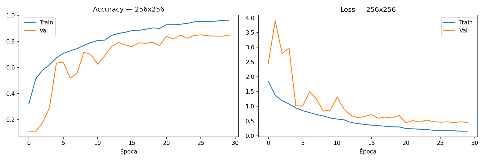
* Accuracy: $0.8319$.
* Confussion Matrix:
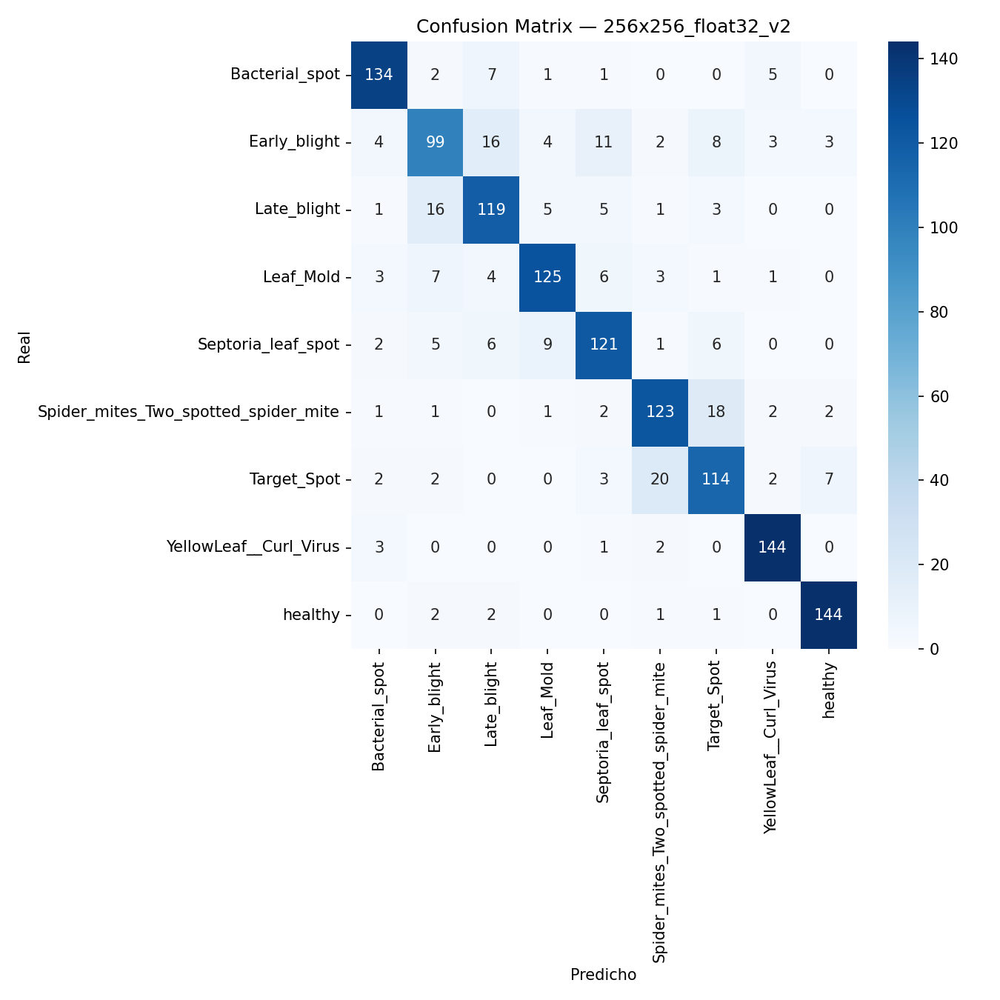

Despues de esto se cuantizo a INT8, donde se obtuvieron los siguientes resultados:

* Conversion de parametros a INT8: $48.953$ s.
* Tamaño del modelo en INT8: $120.8$ KB.
* Accuracy int8: $0.8260$.
* Confussion Matrix:
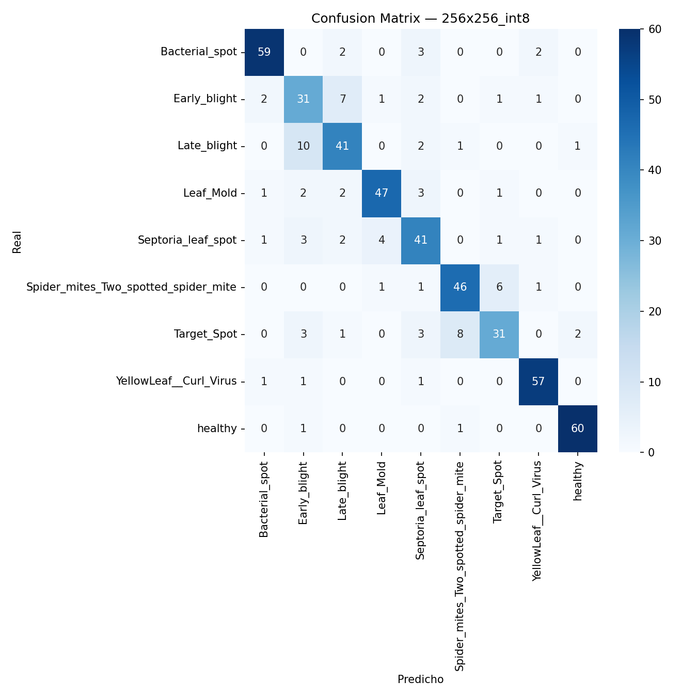

Para finalizar tenemos el modelo cuantizado en INT16, donde los resultados fueron los siguientes:

* Conversion de parametros a INT16: $95.270$ s.
* Tamaño del modelo en INT8: $141.9$ KB.
* Accuracy int16: $0.8440$.
* Confussion Matrix:

#### RESOLUCION 128

Para la segunda etapa de entrenamiento donde se uso las imagenes con un reescalado a $128$ $\times$ $128$, los resultados obtenidos fueron los siguientes:

* Entrenamiento: $8052.963$ s.
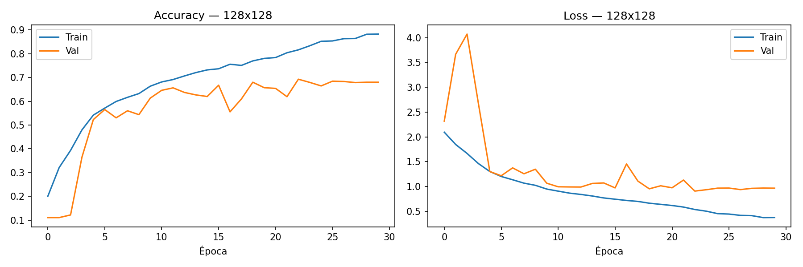
* Accuracy: $0.6793$.
* Tiempo de evaluacion: $75.031$ s.
* Confussion Matrix:
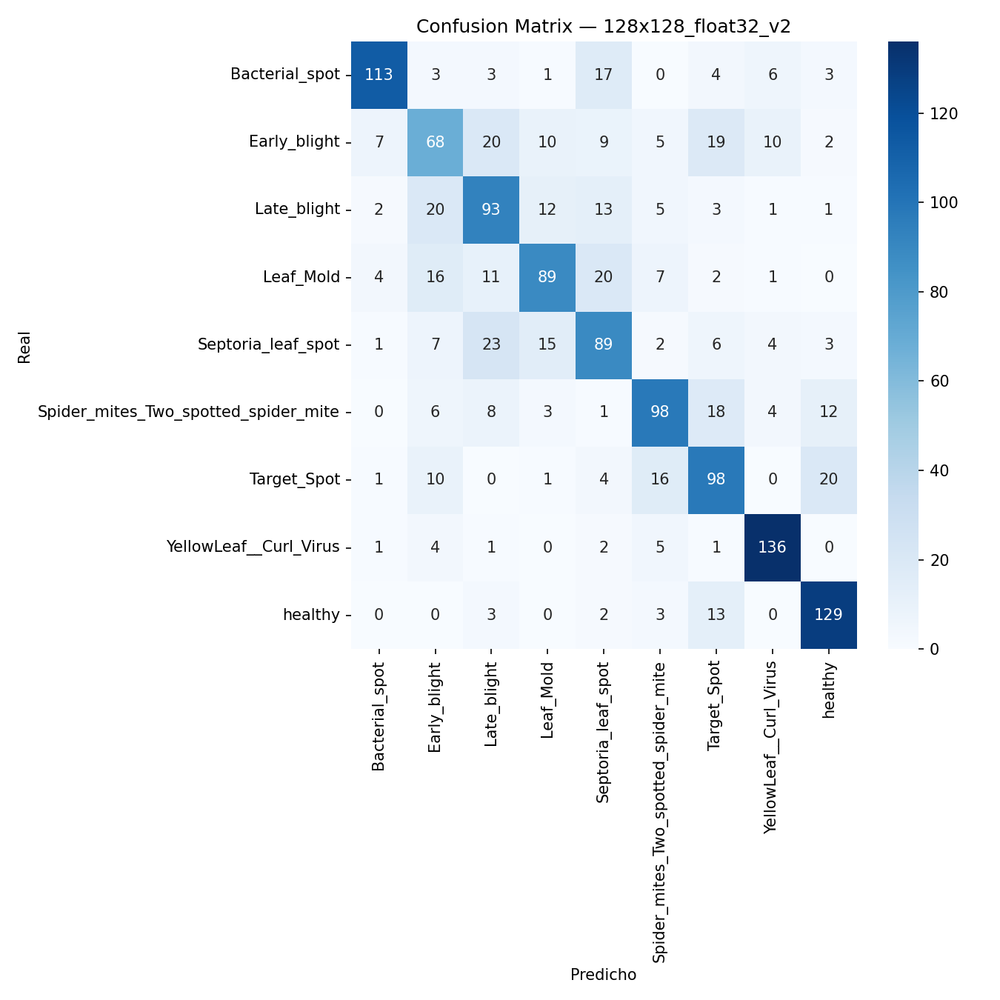

Despues de esto se cuantizo a INT8, donde se obtuvieron los siguientes resultados:

* Conversion de parametros a INT8: $42.980$ s.
* Tamaño del modelo en INT8: $120.8$ KB.
* Accuracy int8: $0.6900$.
* Confussion Matrix:
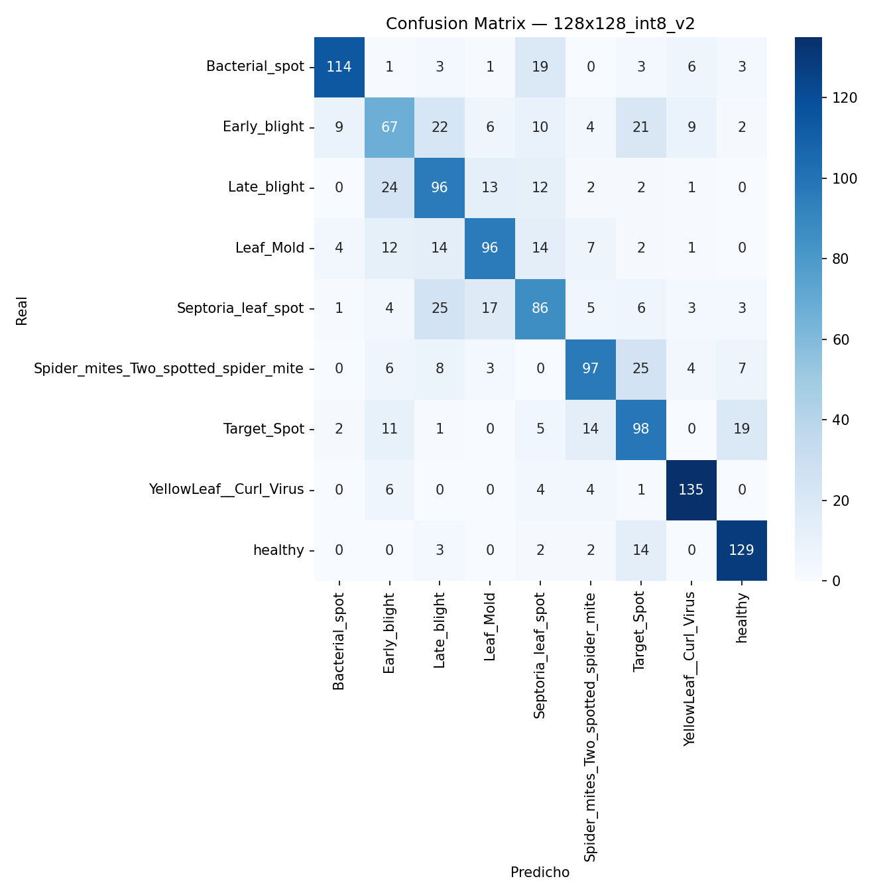

Para finalizar tenemos el modelo cuantizado en INT16, donde los resultados fueron los siguientes:

* Conversion de parametros a INT16: $82.207$ s.
* Tamaño del modelo en INT8: $141.9$ KB.
* Accuracy int16: $0.6680$.
* Confussion Matrix:
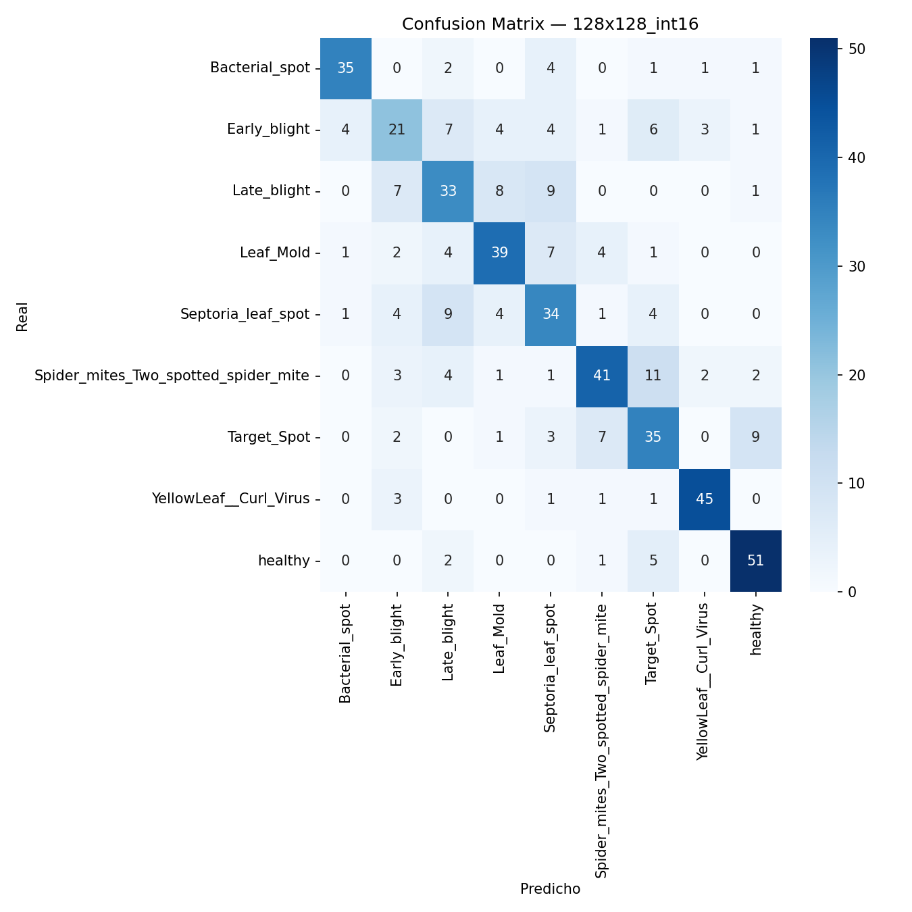

#### RESOLUCION 96

Para la tercer etapa y ultima etapa de entrenamiento donde se uso las imagenes con un reescalado a $96$ $\times$ $96$, los resultados obtenidos fueron los siguientes:

* Entrenamiento: $8052.963$ s.
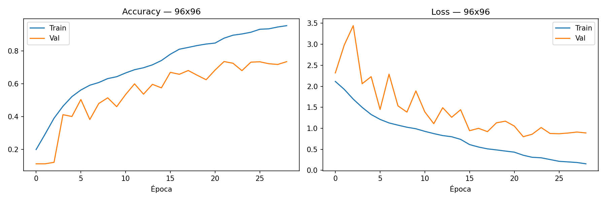
* Accuracy: $0.7274$.
* Tiempo de evaluacion: $72.404$ s.
* Confussion Matrix:

Despues de esto se cuantizo a INT8, donde se obtuvieron los siguientes resultados:

* Conversion de parametros a INT8: $41.845s$ s.
* Tamaño del modelo en INT8: $120.7$ KB.
* Accuracy int8: $0.7120$.
* Confussion Matrix:
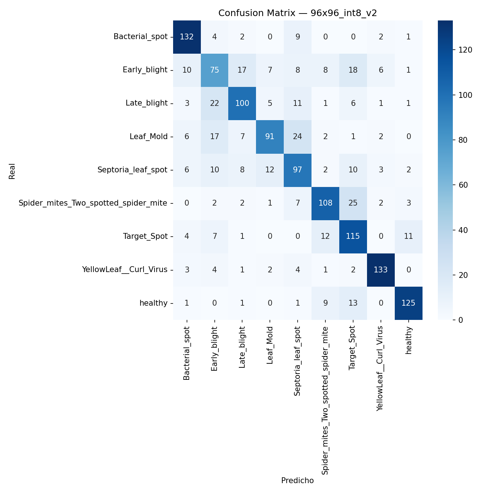

Para finalizar tenemos el modelo cuantizado en INT16, donde los resultados fueron los siguientes:

* Conversion de parametros a INT16: $81.680$ s.
* Tamaño del modelo en INT8: $141.8$ KB.
* Accuracy int16: $0.7380$.
* Confussion Matrix:

## CORRECIONES REALIZADAS

Despues de haber entrenado el modelo por primera vez, se observo que el mejor accuracy obtenido fue cuando se entreno el modelo con las dimensiones originales de las imagenes y cuantizando a INT16, el accuracy que se obtuvo fue de $0.8440$, lo cual fue un buen punto de partida, a partir de aqui se tomaron desiciones respecto a como mejorar este accuracy obtenido, y buscar subirlo lo mayor posible.

Para el primer entrenamiento realizado, se escogio como modelo de segmentacion el metodo grabCut de openCV, este metodo aunque muy rapido, cometio muchos errores a la hora de segmentar algunas imagenes, ya que o les recortaba parte de la hoja, por lo tanto las dejaba incompletas o sino, les agreagaba sombra como si fueran parte de la hoja, haciendo que el modelo aprendiera patrones que no eran correctos debido a la forma en la cual estaban siendo segmentadas.

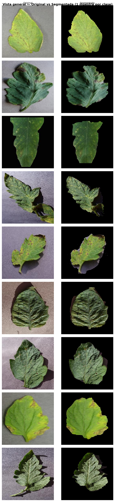

Para poder resolver este problema se tomo la desicion de tomar una muestra aleatoria de cada clase, y realizar el proceso de segmentacion de manera manual, para esto se uso la herramienta open-source labelme, con la cual se realizaron las mascaras de una muestra por clase, por lo que se obtuvieron 9 mascaras.

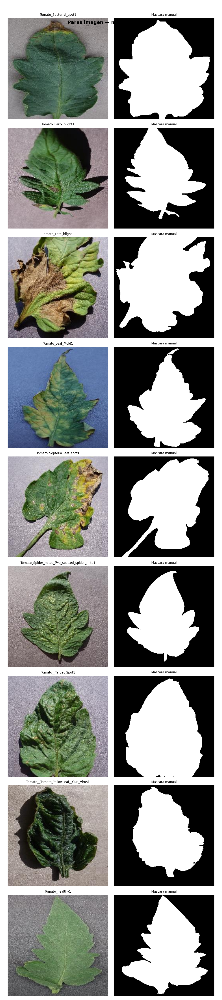

Con las 9 mascaras ya obtenidas se procedio a entrenar un modelo de CNN pequeño llamado U-Net el cual esta desarrollado para la segmentacion de imagenes. La red se basa en una red neuronal completamente convolucional cuya arquitectura se modificó y amplió para funcionar con menos imágenes de entrenamiento y lograr una segmentación más precisa.

El script utilizado para este paso fue el llamado "u_net_segmentation.py", despues de entrenarla con las 9 mascaras obtenidas de forma manual, se utilizo para segmentar todas las imagenes del dataset, por lo que se obtuvieron 9000 imagenes segmentadas de manera mas precisa que usando el metodo de grabCut, a continuacion se muestran unas muestras de esta segmentacion realizada por la red neuronal.

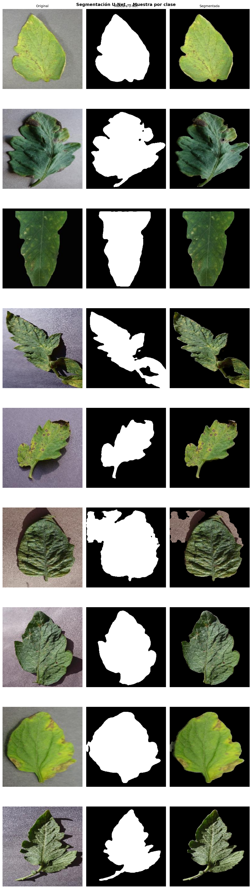

Como se puede ver, los resultados que se obtienen son mucho mejores que los que nos devuelve el metodo de grabCut, ahora con este nuevo dataset de imagenes bien segmentadas, se procedio a realizar un nuevo entrenamiento de la CNN, repitiendo los mismos pasos que en el primer entrenamiento, pero usando este nuevo dataset, los resultados que se obtuvieron fueron los siguientes:

### Segundo Entrenamiento
