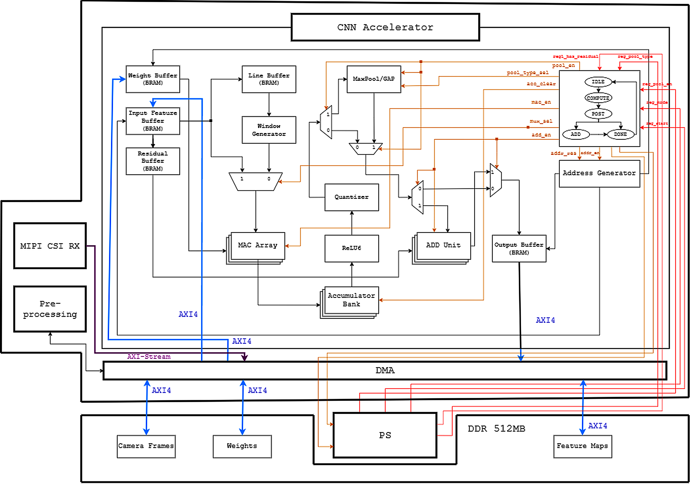

# CNN Hardware Accelerator on Zynq-7020 SoC

Full hardware/software co-design of a CNN inference accelerator, built from RTL up on a Xilinx Zynq-7020 SoC. Custom VHDL processing array, AXI-based DMA, and a bare-metal ARM runtime — running a quantized MobileNetV2 for real-time plant disease classification.

> Undergraduate thesis project · 2026 · In active development

## Overview

This project implements a complete pipeline for deploying a quantized CNN on a Zynq-7020: the Programmable Logic (PL) side computes convolutions using a custom 16-wide MAC array, while a bare-metal application on the dual-core ARM Cortex-A9 (Processing System, PS) handles scheduling, DMA transfers, and layer orchestration.

The model — MobileNetV2, trained and quantized to INT8 — reaches **94.14% accuracy on the PlantVillage dataset**, running entirely on custom hardware rather than a general-purpose NN accelerator IP.

## Key features

- **16-way parallel MAC array** supporting standard Conv3×3, Depthwise Conv3×3, and Pointwise Conv1×1 — the three layer types that make up MobileNetV2's inverted residual blocks.
- **Address Generator** that computes BRAM addresses directly from loop counters, eliminating the need for a separate Line Buffer / Window Generator (a deliberate architectural simplification — see `architecture.md`).
- **Fused quantization + ReLU6 post-processing** (`quant_relu`): shift, clamp, and activation in a single clock cycle for all 16 channels in parallel.
- **Modular pooling unit**: MaxPool2×2 and Global Average Pool implemented as independent blocks behind a shared wrapper (`pool_unit`).
- **Custom DMA + AXI-Lite/AXI-HP interface** between PS and PL, with a bare-metal scheduler on ARM Cortex-A9 that pipelines inference and maximizes on-chip (OCM) memory usage.
- **Documented debugging log**: real timing bugs found in simulation — pipeline hazards, spurious MAC accumulation across FSM transitions, off-by-one addressing, DSP48 inference — each with root cause and fix (see `architecture.md`).

## Architecture


## Repository structure

```
CNN/                                 # top-level CNN accelerator sources
architecture_pl/                     # Vivado project structure (PL side)
axi/                                 # AXI-Lite / AXI-HP interface logic
dma/                                 # custom DMA implementation
runtime_bare_metal/                  # ARM Cortex-A9 bare-metal software
tb/                                  # testbenches
images/                              # diagrams / figures
architecture.md                      # design decisions, address formulas, bug log
socs.md                              # SoC-level integration notes
FSM_main_states.md                   # main control FSM documentation
FSM_AG_states.md                     # Address Generator FSM documentation
Bitacora.md                          # development log
```

## Tech stack

`VHDL` · `Python` (training/quantization) · `Vivado` · `Zynq-7020` · `ARM Cortex-A9 (bare-metal)` · `AXI-Lite/AXI-HP` · `DMA`

## Status

- [x] MAC array, Address Generator, quant_relu, and pooling units implemented in VHDL
- [x] MobileNetV2 trained and quantized to INT8 (94.14% accuracy, PlantVillage)
- [x] Verified in simulation, including a documented set of timing-bug fixes
- [ ] Hardware bring-up on physical Zynq-7020 board
- [ ] End-to-end latency / throughput benchmarking on real hardware


## Engineering notes

The most useful part of this repo for understanding *how* the design evolved is `architecture.md` — it documents real design trade-offs (e.g., why the Line Buffer and Window Generator were cut) and a set of timing bugs found during simulation, each with the exact root cause and the fix applied (pipeline registers for BRAM read latency, spurious-accumulation guards in the FSM, DSP48 pipelining, etc.).

## Author

**Angel Luis Obando Fajardo** — Electronic Engineering student, Pontificia Universidad Javeriana Cali
[LinkedIn](https://www.linkedin.com/in/angel-obando-827600241/)
